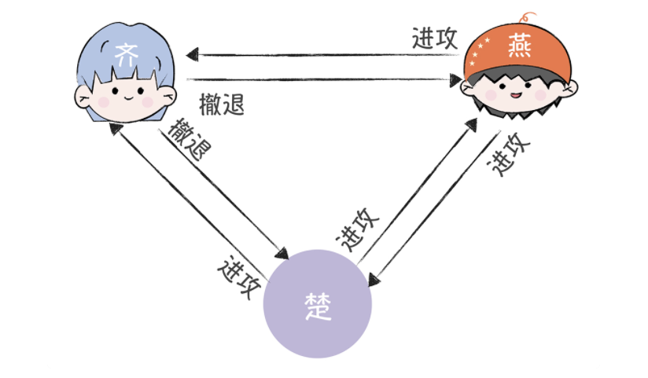
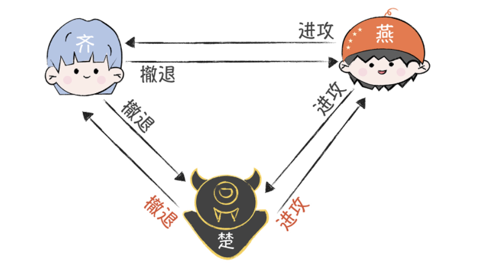
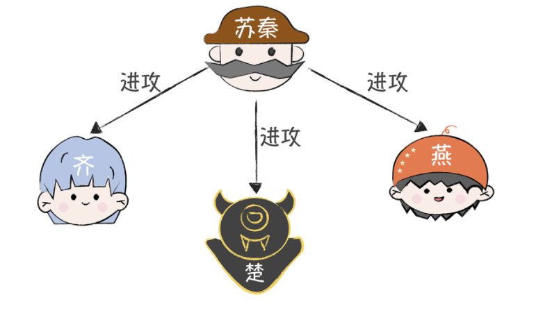
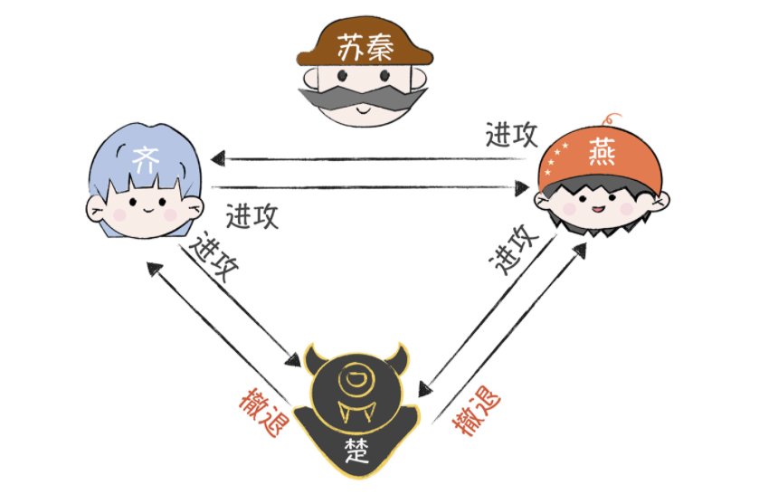
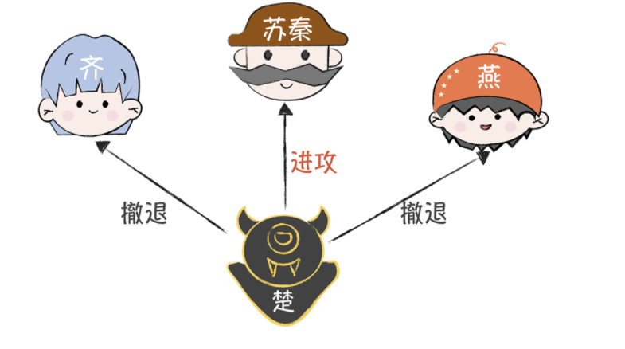
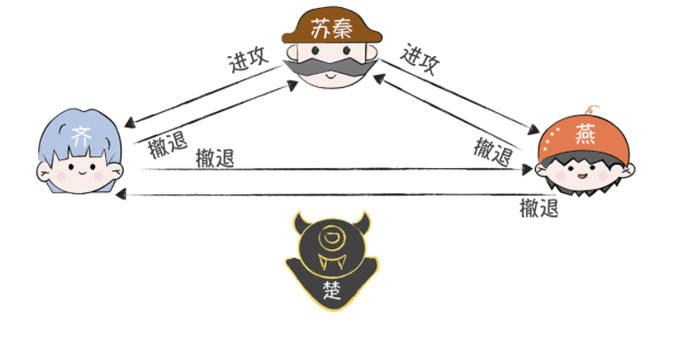
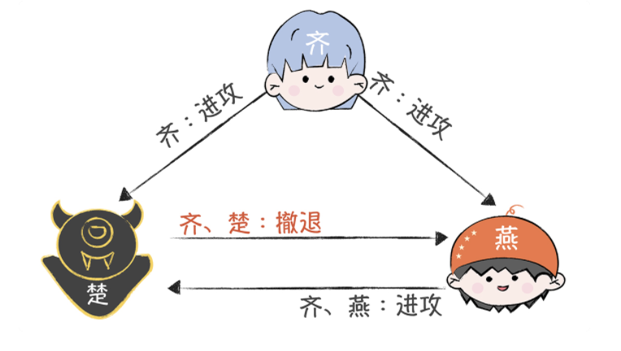
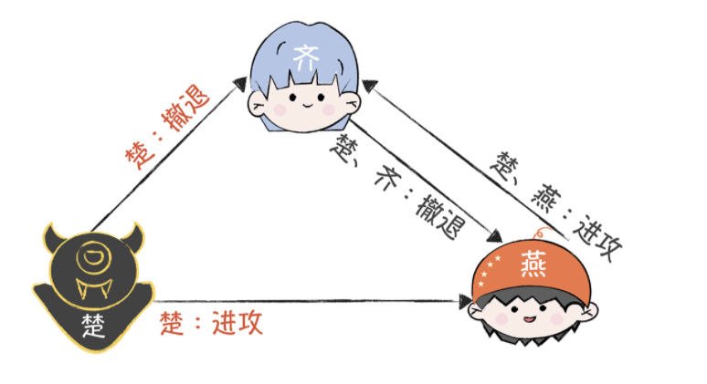

# 分布式算法

解决一致性和可用性

# 拜占庭将军问题

[拜占庭](https://baike.baidu.com/item/拜占庭)位于如今的土耳其的[伊斯坦布尔](https://baike.baidu.com/item/伊斯坦布尔/5544)，是[东罗马帝国](https://baike.baidu.com/item/东罗马帝国/7471260)的首都。由于当时拜占庭罗马帝国国土辽阔，为了达到防御目的，每个军队都分隔很远，将军与将军之间只能靠信差传消息。在战争的时候，拜占庭军队内所有将军和副官必须达成一致的共识，决定是否有赢的机会才去攻打敌人的阵营。但是，在军队内有可能存有叛徒和敌军的间谍，左右将军们的决定又扰乱整体军队的秩序。在进行共识时，结果并不代表大多数人的意见。这时候，在已知有成员谋反的情况下，其余忠诚的将军在不受叛徒的影响下如何达成一致的协议，拜占庭问题就此形成。

**苏秦的困境**

战国时期，齐、楚、燕、韩、赵、魏、秦七雄并立，后来秦国的势力不断强大起来，成了东

方六国的共同威胁。于是，这六个国家决定联合，全力抗秦，免得被秦国各个击破。一天，

苏秦作为合纵长，挂六国相印，带着六国的军队叩关函谷，驻军在了秦国边境，为围攻秦国

作准备。但是，因为各国军队分别驻扎在秦国边境的不同地方，所以军队之间只能通过信使

互相联系，这时，苏秦面临了一个很严峻的问题：如何统一大家的作战计划？

万一一些诸侯国在暗通秦国，发送误导性的作战信息，怎么办？如果信使被敌人截杀，甚至

被敌人间谍替换，又该怎么办？这些都会导致自己的作战计划被扰乱，然后出现有的诸侯国

在进攻，有的诸侯国在撤退的情况，而这时，秦国一定会趁机出兵，把他们逐一击破的。

**所以，如何达成共识，制定统一的作战计划呢？苏秦他很愁。**

这个故事，是拜占庭将军问题的一个简化表述，苏秦面临的就是典型的共识难题，也就是如何在可能有误导信息的情况下，采用合适的通讯机制，让多个将军达成共识，制定一致性的作战计划？

## 二忠一叛的难题

为了便于你理解和层层深入，我先假设只有 3 个国家要攻打秦国，这三个国家的三位将

军，咱们简单点儿，分别叫齐、楚、燕。同时，又因为秦国很强大，所以只有半数以上的将

军参与进攻，才能击败敌人（注意，这里是假设哈，你别较真），在这个期间，将军们彼此

之间需要通过信使传递消息，然后协商一致之后，才能在同一时间点发动进攻。

举个例子，有一天，这三位将军各自一脸严肃地讨论明天是进攻还是撤退，并让信使传递信

息，按照“少数服从多数”的原则投票表决，两个人意见一致就可以了，比如：

1. 齐根据侦查情况决定撤退；

2. 楚和燕根据侦查信息，决定进攻。

那么按照原则，齐也会进攻。最终，3 支军队同时进攻，大败秦军。

**可是，问题来了：** 一旦有人在暗通秦国，就会出现作战计划不一致的情况。比如齐向楚、

燕分别发送了“撤退”的消息，燕向齐和楚发送了“进攻”的消息。**撤退：进攻 =1:1，无**

**论楚投进攻还是撤退，都会成为 2:1，这个时候还是会形成一个一致性的作战方案。**

但是，楚这个叛徒在暗中配合秦国，让信使向齐发送了“撤退”，向燕发送了“进攻”，那

么：

燕看到的是，撤退：进攻 =1:2；

齐看到的是，撤退：进攻 =2:1。按照“少数服从多数”的原则，就会出现燕单独进攻秦军，当然，最后肯定是因为寡不敌众，被秦军给灭了。

**苏秦该怎么办？**

## **解决办法一：口信消息型拜占庭问题之解**

先来说说第一个解决办法。首先，三位将军都分拨一部分军队，由苏秦率领，苏秦参与作战

计划讨论并执行作战指令。这样，3 位将军的作战讨论，就变为了 4 位将军的作战讨论，

这能够增加讨论中忠诚将军的数量。

然后呢，4 位将军还约定了，如果没有收到命令，就执行预设的默认命令，比如“撤退”。

除此之外，还约定一些流程来发送作战信息、执行作战指令，比如，进行两轮作战信息协

商。为什么要执行两轮呢？先卖个关子，你一会儿就知道了。

**第一轮：**

先发送作战信息的将军作为指挥官，其他的将军作为副官；

指挥官将他的作战信息发送给每位副官；

每位副官，将从指挥官处收到的作战信息，作为他的作战指令；如果没有收到作战信

息，将把默认的“撤退”作为作战指令。

**第二轮：**

除了第一轮的指挥官外，剩余的 3 位将军将分别作为指挥官，向另外 2 位将军发送作战

信息；

然后，这 3 位将军按照“少数服从多数”，执行收到的作战指令。

为了帮助你直观地理解苏秦的整个解决方案，我来演示一下作战信息协商过程。**而且，我会**

**分别以忠诚将军和叛将先发送作战信息为例来演示，** 这样可以完整地演示叛将对作战计划

干扰破坏的可能性。

==首先是 3 位忠诚的将军先发送作战信息的情况。==

为了演示方便，假设苏秦先发起作战信息，作战指令是“进攻”。那么在第一轮作战信息协

商中，苏秦向齐、楚、燕发送作战指令“进攻。

在第二轮作战信息协商中，齐、楚、燕分别作为指挥官，向另外 2 位发送作战信息“进攻”，因为楚已经叛变了，所以，为了干扰作战计划，他就对着干，发送“撤退”作战指令。

最终，齐和燕收到的作战信息都是“进攻、进攻、撤退”，按照原则，齐和楚与苏秦一起执行作战指令“进攻”，实现了作战计划的一致性，保证了作战的胜利。

那么，如果是叛徒楚先发送作战信息，干扰作战计划，结果会有所不同么？我们来具体看一看。在第一轮作战信息协商中，楚向苏秦发送作战指令“进攻”，向齐、燕发送作战指令“撤退”。

然后，在第二轮作战信息协商中，苏秦、齐、燕分别作为指挥官，向另外两位发送作战信息。

最终，苏秦、齐和燕收到的作战信息都是“撤退、撤退、进攻”，按照原则，苏秦、齐和楚一起执行作战指令“撤退”，实现了作战计划的一致性。也就是说，无论叛将楚如何捣乱，苏秦、齐和燕，都执行一致的作战计划，保证作战的胜利。

**如果叛将人数为 m，将军人数不能少于 3m + 1 ，那么拜占庭将军问题就能解决了。** 

## 签名消息性拜占庭问题之解

其实，苏秦还可以通过签名的方式，在不增加将军人数的情况下，解决二忠一叛的难题。首先，苏秦要通过印章、虎符等信物，实现这样几个特性：

- 忠诚将军的签名无法伪造，而且对他签名消息的内容进行任何更改都会被发现；
- 任何人都能验证将军签名的真伪。

这时，如果忠诚的将军，比如齐先发起作战信息协商，一旦叛将小楚修改或伪造收到的作战信息，那么燕在接收到楚的作战信息的时候，会发现齐的作战信息被修改，楚已叛变，这时他执行齐发送的作战信息。

如果叛变将军楚先发送误导的作战信息，那么齐和燕将发现楚发送的作战信息是不一致的，知道楚已经叛变。这个时候，他们可以先处理叛将，然后再重新协商作战计划。

这个解决办法，是兰伯特在论文中提到的签名消息型拜占庭问题之解。而通过签名机制约束叛将的叛变行为，任何叛变行为都会被发现，也就会实现无论有多少忠诚的将军和多少叛将，忠诚的将军们总能达成一致的作战计划。

# 内容总结

- 故事里的各位将军，你可以理解为计算机节点；
- 忠诚的将军，你可以理解为正常运行的计算机节点；
- 叛变的将军，你可以理解为出现故障并会发送误导信息的计算机节点；
- 信使被杀，可以理解为通讯故障、信息丢失；
- 信使被间谍替换，可以理解为通讯被中间人攻击，攻击者在恶意伪造信息和劫持通讯。

这样一来，你是不是就理解了计算机分布式场景中面临的问题，并且知道了解决的办法呢？那么我想强调的是，拜占庭将军问题描述的是最困难的，也是最复杂的一种分布式故障场景，除了存在故障行为，还存在恶意行为的一个场景。你要注意，在存在恶意节点行为的场景中（比如在数字货币的区块链技术中），必须使用拜占庭容错算法（Byzantine FaultTolerance，BFT）。除了故事中提到两种算法，常用的拜占庭容错算法还有：PBFT 算法PoW 算法（为了重点突出，这些内容我会在后面讲解）。

而在计算机分布式系统中，最常用的是非拜占庭容错算法，即故障容错算法（Crash FaultTolerance，CFT）。**CFT 解决的是分布式的系统中存在故障，但不存在恶意节点的场景下**的共识问题。** 也就是说，这个场景可能会丢失消息，或者有消息重复，但不存在错误消息，或者伪造消息的情况。常见的算法有 Paxos 算法、Raft 算法、ZAB 协议

