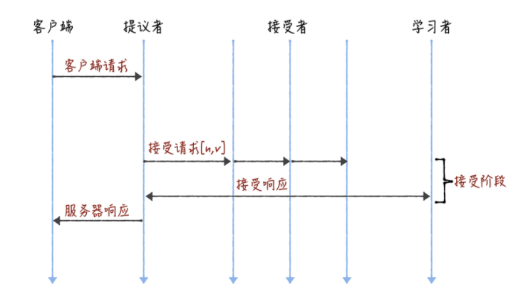
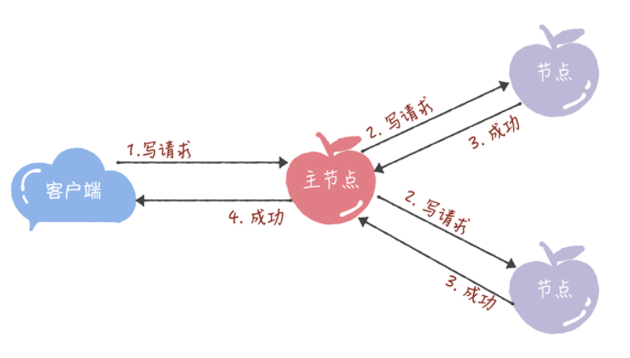

# Paxos强一致性

Paxos 算法在分布式领域具有非常重要的地位，开源分布式锁组件 Google Chubby 的作者 Mike Burrows 说过，这个世界上只有一种一致性算法，那就是 Paxos 算法，其他的算法都是残次品。

Paxos 算法虽然重要，但是也因算法复杂而著名，不过 Paxos 算法是学习分布式系统必需的一个知识点，这一课时我们就知难而上，一起来学习下 Paxos 算法。

# Quorum 机制

在学习 Paxos 算法之前，我们先来看分布式系统中的 Quorum 选举算法。在各种一致性算法中都可以看到Quorum 机制的身影，主要数学思想来源于抽屉原理，用一句话解释那就是，在 N 个副本中，一次更新成功的如果有 W 个，那么我在读取数据时是要从大于 N－W 个副本中读取，这样就能至少读到一个更新的数据了。

和 Quorum 机制对应的是 WARO，也就是**Write All Read one**，是一种简单的副本控制协议，当 Client 请求向某副本写数据时（更新数据），只有当所有的副本都更新成功之后，这次写操作才算成功，否则视为失败。

==WARO 优先保证读服务==，因为所有的副本更新成功，才能视为更新成功，从而保证了所有的副本一致，这样的话，只需要读任何一个副本上的数据即可。写服务的可用性较低，因为只要有一个副本更新失败，此次写操作就视为失败了。假设有 N 个副本，N－1 个都宕机了，剩下的那个副本仍能提供读服务；但是只要有一个副本宕机了，写服务就不会成功。

WARO 牺牲了更新服务的可用性，最大程度地增强了读服务的可用性，而 Quorum 就是在更新服务和读服务之间进行的一个折衷。

# Quorum 定义

Quorum 的定义如下：假设有 N 个副本，更新操作 wi 在 W 个副本中更新成功之后，才认为此次更新操作 wi 成功，把这次成功提交的更新操作对应的数据叫做：“成功提交的数据”。对于读操作而言，至少需要读 R 个副本才能读到此次更新的数据，其中，W+R>N ，即 W 和 R 有重叠，一般，W+R=N+1。

N = 存储数据副本的数量

W = 更新成功所需的副本

R = 一次数据对象读取要访问的副本的数量

Quorum就是限定了一次需要读取至少N+1-w的副本数据,听起来有些抽象，举个例子，我们维护了10个副本，一次成功更新了三个，那么至少需要读取八个副本的数据，可以保证我们读到了最新的数据。

# Quorum 的应用

Quorum 机制无法保证强一致性，也就是无法实现任何时刻任何用户或节点都可以读到最近一次成功提交的副本数据。

Quorum 机制的使用需要配合一个获取最新成功提交的版本号的 metadata 服务，这样可以确定最新已经成功提交的版本号，然后从已经读到的数据中就可以确认最新写入的数据。

Quorum 是分布式系统中常用的一种机制，用来保证数据冗余和最终一致性的投票算法，在 Paxos、Raft 和 ZooKeeper 的 Zab 等算法中，都可以看到 Quorum 机制的应用。

==Paxos 节点的角色和交互==

了解了 Quorum 机制，我们接下来学习 Paxos 算法，首先看一下 Paxos 算法中的节点角色和交互。

==Paxos 的节点角色==

在 Paxos 协议中，有三类节点角色，分别是 Proposer、Acceptor 和 Learner，另外还有一个 Client，作为产生议题者。

上述三类角色只是逻辑上的划分，在工作实践中，一个节点可以同时充当这三类角色。

Proposer 提案者

Proposer 可以有多个，在流程开始时，Proposer 提出议案，也就是value，所谓 value，在工程中可以是任何操作，比如“修改某个变量的值为某个新值”，Paxos 协议中统一将这些操作抽象为 value。

不同的 Proposer 可以提出不同的甚至矛盾的 value，比如某个 Proposer 提议“将变量 X 设置为 1”，另一个 Proposer 提议“将变量 X 设置为 2”，但对同一轮 Paxos 过程，最多只有一个 value 被批准。

Acceptor 批准者

在集群中，Acceptor 有 N 个，Acceptor 之间完全对等独立，Proposer 提出的 value 必须获得超过半数（N/2+1）的 Acceptor 批准后才能通过。

Learner 学习者

Learner 不参与选举，而是学习被批准的 value，在Paxos中，Learner主要参与相关的状态机同步流程。

这里Leaner的流程就参考了Quorum 议会机制，某个 value 需要获得 W=N/2 + 1 的 Acceptor 批准，Learner 需要至少读取 N/2+1 个 Accpetor，最多读取 N 个 Acceptor 的结果后，才能学习到一个通过的 value。

Client 产生议题者

Client 角色，作为产生议题者，实际不参与选举过程，比如发起修改请求的来源等。

Proposer 与 Acceptor 之间的交互

Paxos 中， Proposer 和 Acceptor 是算法核心角色，Paxos 描述的就是在一个由多个 Proposer 和多个 Acceptor 构成的系统中，如何让多个 Acceptor 针对 Proposer 提出的多种提案达成一致的过程，而 Learner 只是“学习”最终被批准的提案。

Proposer 与 Acceptor 之间的交互主要有 4 类消息通信，如下图：

这 4 类消息对应于 Paxos 算法的两个阶段 4 个过程，下面在分析选举过程时会讲到。

# Paxos 选举过程

选举过程可以分为两个部分，准备阶段和选举阶段，可以查看下面的时序图：

Phase 1 准备阶段

Proposer 生成全局唯一且递增的 ProposalID，向 Paxos 集群的所有机器发送 Prepare 请求，这里不携带 value，只携带 N 即 ProposalID。

Acceptor 收到 Prepare 请求后，判断收到的 ProposalID 是否比之前已响应的所有提案的 N 大，如果是，则：

在本地持久化 N，可记为 Max_N；

回复请求，并带上已经 Accept 的提案中 N 最大的 value，如果此时还没有已经 Accept 的提案，则返回 value 为空；

做出承诺，不会 Accept 任何小于 Max_N 的提案。

如果否，则不回复或者回复 Error。

Phase 2 选举阶段

为了方便描述，我们把 Phase 2 选举阶段继续拆分为 P2a、P2b 和 P2c。

==P2a：Proposer 发送 Accept==

经过一段时间后，Proposer 收集到一些 Prepare 回复，有下列几种情况：

若回复数量 > 一半的 Acceptor 数量，且所有回复的 value 都为空时，则 Porposer 发出 accept 请求，并带上自己指定的 value。

若回复数量 > 一半的 Acceptor 数量，且有的回复 value 不为空时，则 Porposer 发出 accept 请求，并带上回复中 ProposalID 最大的 value，作为自己的提案内容。

若回复数量 <= 一半的 Acceptor 数量时，则尝试更新生成更大的 ProposalID，再转到准备阶段执行。

==P2b：Acceptor 应答 Accept==

Accpetor 收到 Accpet 请求 后，判断：

若收到的 N >= Max_N（一般情况下是等于），则回复提交成功，并持久化 N 和 value；

若收到的 N < Max_N，则不回复或者回复提交失败。

==P2c: Proposer 统计投票==

经过一段时间后，Proposer 会收集到一些 Accept 回复提交成功的情况，比如：

当回复数量 > 一半的 Acceptor 数量时，则表示提交 value 成功，此时可以发一个广播给所有的 Proposer、Learner，通知它们已 commit 的 value；

当回复数量 <= 一半的 Acceptor 数量时，则尝试更新生成更大的 ProposalID，转到准备阶段执行。

当收到一条提交失败的回复时，则尝试更新生成更大的 ProposalID，也会转到准备阶段执行。

# 三种角色关系

**提议者（Proposer）**：提议一个值，用于投票表决。为了方便演示，你可以把图 1 中的

客户端 1 和 2 看作是提议者。但在绝大多数场景中，集群中收到客户端请求的节点，才

是提议者（图 1 这个架构，是为了方便演示算法原理）。这样做的好处是，对业务代码

没有入侵性，也就是说，我们不需要在业务代码中实现算法逻辑，就可以像使用数据库

一样访问后端的数据。

**接受者（Acceptor）**：对每个提议的值进行投票，并存储接受的值，比如 A、B、C 三

个节点。 一般来说，集群中的所有节点都在扮演接受者的角色，参与共识协商，并接受

和存储数据。

讲到这儿，你可能会有疑惑：前面不是说接收客户端请求的节点是提议者吗？这里怎么又是

接受者呢？这是因为一个节点（或进程）可以身兼多个角色。想象一下，一个 3 节点的集

群，1 个节点收到了请求，那么该节点将作为提议者发起二阶段提交，然后这个节点和另外

2 个节点一起作为接受者进行共识协商，就像下图的样子：

**学习者（Learner）**：被告知投票的结果，接受达成共识的值，存储保存，不参与投票的

过程。一般来说，学习者是数据备份节点，比如“Master-Slave”模型中的 Slave，被

动地接受数据，容灾备份。

# Paxos 常见的问题

关于Paxos协议，有几个常见的问题，简单介绍下。

**1.如果半数以内的 Acceptor 失效，如何正常运行？**

在Paxos流程中，如果出现半数以内的 Acceptor 失效，可以分为两种情况：

第一种，如果半数以内的 Acceptor 失效时还没确定最终的 value，此时所有的 Proposer 会重新竞争提案，最终有一个提案会成功提交。

第二种，如果半数以内的 Acceptor 失效时已确定最终的 value，此时所有的 Proposer 提交前必须以最终的 value 提交，也就是Value实际已经生效，此值可以被获取，并不再修改。

2. **Acceptor需要接受更大的N，也就是ProposalID有什么意义？**

这种机制可以防止其中一个Proposer崩溃宕机产生阻塞问题，允许其他Proposer用更大ProposalID来抢占临时的访问权。

3. **如何产生唯一的编号，也就是 ProposalID？**

在《Paxos made simple》论文中提到，唯一编号是让所有的 Proposer 都从不相交的数据集合中进行选择，需要保证在不同Proposer之间不重复，比如系统有 5 个 Proposer，则可为每一个 Proposer 分配一个标识 j(0~4)，那么每一个 Proposer 每次提出决议的编号可以为 5*i + j，i 可以用来表示提出议案的次数。

# 流程图

提案  准备请求Prepare。接受Accept请求

processon 

# Chubby 介绍

Google Chubby是一个分布式锁服务，Chubby底层一致性实现就是以Paxos为基础的。

Chubby是一个面向松耦合分布式系统的锁服务，通常用于为一个由大量小型计算机构成的松耦合分布式系统提供高可用的锁服务。一个分布式锁服务的目的是允许他的客户端进程同步彼此的操作，并对当前所处环境的基本状态信息达成一致。

# Multi-Paxos================================================================================

Basic Paxos 只能就单个值（Value）达成共识，一旦遇到为一系列的值实现共识的时候，它就不管用了。虽然兰伯特提到可以通过多次执行 Basic Paxos 实例（比如每接收到一个值时，就执行一次 Basic Paxos 算法）实现一系列值的共识。

 ==Chubby 的 Multi-Paxos 实现、Raft 算法、ZAB 协议等==

**兰伯特提到的 Multi-Paxos 是一种思想，不是算法。而 Multi-Paxos 算法是一个统称，它是指基于 Multi-Paxos 思想，通过多个 Basic Paxos 实例实现一系列值的共识的算法（比如 Chubby 的 Multi-Paxos 实现、Raft 算法等）。**

# basic Paxos的痛点

Basic Paxos 是通过二阶段提交来达成共识的。在第一阶段，也就是准备阶段，接收到大多数准备响应的提议者，才能发起接受请求进入第二阶段（也就是接受阶段）：

而如果我们直接通过多次执行 Basic Paxos 实例，来实现一系列值的共识，就会存在这样几个问题：

- 如果多个提议者同时提交提案，可能出现因为提案冲突，在准备阶段没有提议者接收到大多数准备响应，协商失败，需要重新协商。你想象一下，一个 5 节点的集群，如果 3 个节点作为提议者同时提案，就可能发生因为没有提议者接收大多数响应（比如 1 个提议者接收到 1 个准备响应，另外 2 个提议者分别接收到 2 个准备响应）而准备失败，需要重新协商。

- 2 轮 RPC 通讯（准备阶段和接受阶段）往返消息多、耗性能、延迟大。你要知道，分布式系统的运行是建立在 RPC 通讯的基础之上的，因此，延迟一直是分布式系统的痛点，是需要我们在开发分布式系统时认真考虑和优化的。

# 解决方式---领导者Leader

我们可以通过引入领导者节点，也就是说，领导者节点作为唯一提议者，这样就不存在多个提议者同时提交提案的情况，也就不存在提案冲突的情况了：

**兰伯特没有说如何选举领导者，需要我们在实现 Multi-Paxos 算法的时候自己实现。** 比如在 Chubby 中，主节点（也就是领导者节点）是通过执行 Basic Paxos 算法，进行投票选举产生的。

# 优化 Basic Paxos 执行

我们可以采用“当领导者处于稳定状态时，省掉准备阶段，直接进入接受阶段”这个优化机制，优化 Basic Paxos 执行。也就是说，领导者节点上，序列中的命令是最新的，不再需要通过准备请求来发现之前被大多数节点通过的提案，领导者可以==独立指定提案中的值==。这时，领导者在提交命令时，可以省掉准备阶段，直接进入到接受阶段：

和重复执行 Basic Paxos 相比，Multi-Paxos 引入领导者节点之后，因为只有领导者节点一个提议者，只有它说了算，所以就不存在提案冲突。另外，当主节点处于稳定状态时，就省掉准备阶段，直接进入接受阶段，所以在很大程度上减少了往返的消息数，提升了性能，降低了延迟。

# Chubby 的 Multi-Paxos 实现

首先，它通过引入主节点，实现了兰伯特提到的领导者（Leader）节点的特性。也就是说，主节点作为唯一提议者，这样就不存在多个提议者同时提交提案的情况，也就不存在提案冲突的情况了。

另外，在 Chubby 中，主节点是通过执行 Basic Paxos 算法，进行投票选举产生的，并且在运行过程中，主节点会通过不断续租的方式来延长租期（Lease）。比如在实际场景中，几天内都是同一个节点作为主节点。如果主节点故障了，那么其他的节点又会投票选举出新的主节点，也就是说主节点是一直存在的，而且是唯一的。

其次，在 Chubby 中实现了兰伯特提到的，“当领导者处于稳定状态时，省掉准备阶段，直接进入接受阶段”这个优化机制。

最后，在 Chubby 中，实现了成员变更（Group membership），以此保证节点变更的时候集群的平稳运行。

**在 Chubby 中，为了实现了==强一致性==，读操作也只能在主节点上执行。** 也就是说，只要数据写入成功，之后所有的客户端读到的数据都是一致的。具体的过程，就是下面的样子。

所有的读请求和写请求都由主节点来处理。当主节点从客户端接收到写请求后，作为提议者，执行 Basic Paxos 实例，将数据发送给所有的节点，并且在大多数的服务器接受了这个写请求之后，再响应给客户端成功：

当主节点接收到读请求后，处理就比较简单了，主节点只需要查询本地数据，然后返回给客户端就可以了：

Chubby 的 Multi-Paxos 实现，尽管是一个闭源的实现，但这是 Multi-Paxos 思想在实际场景中的真正落地，Chubby 团队不仅编程实现了理论，还探索了如何补充细节。其中的思考和设计非常具有参考价值，不仅能帮助我们理解 Multi-Paxos 思想，还能帮助我们理解其他的 Multi-Paxos 算法（比如 Raft 算法）。

# 总结

- 兰伯特提到的 Multi-Paxos 是一种思想，不是算法，而且还缺少算法过程的细节和编程所必须的细节，比如如何选举领导者等，这也就导致了每个人实现的 Multi-Paxos 都不一样。而 Multi-Paxos 算法是一个统称，它是指基于 Multi-Paxos 思想，通过多个 Basic Paxos 实例实现一系列数据的共识的算法（比如 Chubby 的 Multi-Paxos 实现、Raft 算法等）。

- Chubby 实现了主节点（也就是兰伯特提到的领导者），也实现了兰伯特提到的 **“当领导者处于稳定状态时，省掉准备阶段，直接进入接受阶段”** 这个优化机制，省掉 Basic Paxos 的准备阶段，提升了数据的提交效率，但是所有写请求都在主节点处理，限制了集群处理写请求的并发能力，约等于单机。

- 因为在 Chubby 的 Multi-Paxos 实现中，也约定了“大多数原则”，也就是说，只要大多数节点正常运行时，集群就能正常工作，所以 Chubby 能容错（n - 1）/2 个节点的故障。

- 本质上而言，“当领导者处于稳定状态时，省掉准备阶段，直接进入接受阶段”这个优化机制，是通过减少非必须的协商步骤来提升性能的。这种方法非常常用，也很有效。比如，Google 设计的 QUIC 协议，是通过减少 TCP、TLS 的协商步骤，优化 HTTPS 性能。**我希望你能掌握这种性能优化思路，后续在需要时，可以通过减少非必须的步骤，优化系统性能。**

Basic Paxos 是经过证明的，而 Multi-Paxos 是一种思想，缺失实现算法的必须编程细节，这就导致，Multi-Paxos 的最终算法实现，是建立在一个未经证明的基础之上的，正确性是个问号。

**与此同时，实现 Multi-Paxos 算法，最大的挑战是如何证明它是正确的。** 比如 Chubby 的作者做了大量的测试，和运行一致性检测脚本，验证和观察系统的健壮性。在实际使用时，我不推荐你设计和实现新的 Multi-Paxos 算法，而是建议优先考虑 Raft 算法，因为 Raft 的正确性是经过证明的。当 Raft 算法不能满足需求时，你再考虑实现和优化 Multi-Paxos 算法。

