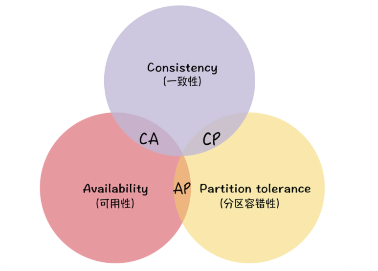

# CAP 

三指标

- 一致性（Consistency）
- 可用性（Availability）
- 分区容错性（Partition Tolerance）

**一致性强调的不是数据完整，而是各节点间的数据一致。**

**可用性强调的是服务可用，但不保证数据的一致**

**在分布式系统中分区容忍是必须要考虑的**

## CAP的不可能三角

CAP 不可能三角说的是对于一个分布式系统而言，一致性（Consistency）、可用性（Availability）、分区容错性（Partition Tolerance）3 个指标不可兼得，只能在 3 个指标中选择 2 个。

只要有网络交互就一定会有延迟和数据丢失，而这种状况我们必须接受，还必须保证系统不能挂掉。所以就像我上面提到的，节点间的分区故障是必然发生的。也就是说，分区容错性（P）是前提，是必须要保证的。现在就只剩下一致性（C）和可用性（A）可以选择了：要么选择一致性，保证数据绝对一致；要么选择可用性，保证服务可用。那么 CP 和 AP 的含义是什么呢？

- 当选择了一致性（C）的时候，如果因为消息丢失、延迟过高发生了网络分区，部分节点无法保证特定信息是最新的，那么这个时候，当集群节点接收到来自客户端的写请求时，因为无法保证所有节点都是最新信息，所以系统将返回写失败错误，也就是说集群拒绝新数据写入。

- 当选择了可用性（A）的时候，系统将始终处理客户端的查询，返回特定信息，如果发生了网络分区，一些节点将无法返回最新的特定信息，它们将返回自己当前的相对新的信息。

**大部分人对 CAP 理论有个误解，认为无论在什么情况下，分布式系统都只能在 C 和 A 中选择 1 个。** 其实，在不存在网络分区的情况下，也就是分布式系统正常运行时（这也是系统在绝大部分时候所处的状态），就是说在不需要 P 时，C 和 A 能够同时保证。只有当发生分区故障的时候，也就是说需要 P 时，才会在 C 和 A 之间做出选择。而且如果各节点数据不一致，影响到了系统运行或业务运行（也就是说会有负面的影响），推荐选择 C，否则选 A。

**==在系统中，不存在网络分区的原因 C（一致性）A（可用性）是可以同时存在的，不考虑系统因为网络原因所导致的故障，是不需要P的存在==**

## 总结

- **CA 模型**，在分布式系统中不存在。因为舍弃 P，意味着舍弃分布式系统，就比如单机版关系型数据库 MySQL，如果 MySQL 要考虑主备或集群部署时，它必须考虑 P。

- **CP 模型**，采用 CP 模型的分布式系统，一旦因为消息丢失、延迟过高发生了网络分区，就影响用户的体验和业务的可用性。因为为了防止数据不一致，集群将拒绝新数据的写入，典型的应用是 ZooKeeper，Etcd 和 HBase。

- **AP 模型**，采用 AP 模型的分布式系统，实现了服务的高可用。用户访问系统的时候，都能得到响应数据，不会出现响应错误，但当出现分区故障时，相同的读操作，访问不同的节点，得到响应数据可能不一样。典型应用就比如 Cassandra 和 DynamoDB。

