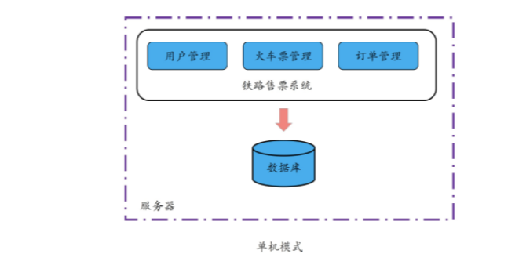
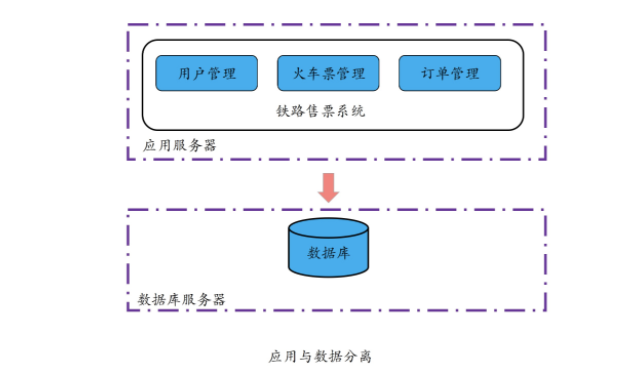
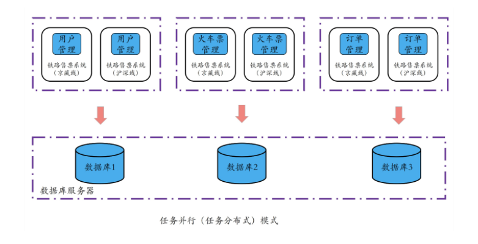

# 架构相关

## 单机模式

==单机模式指的是，所有业务和数据均部署到同一台机器上。这种模式的好处是功能、代码和数据集中，便于维护、管理和执行，但计算效率是瓶颈。也就是说单机模式性能受限，也存在单点失效的问题。==

单个计算机的处理能力取决于 CPU 和内存等，但硬件的发展速度和性能是有限的，而且升级硬件的性价比也是我们要考虑的，由此决定了 CPU 和内存等硬件的性能将成为单机模式的瓶颈。

**问题**

1. 性能受限
2. 存在单点失效的问题

为解决单机模式的问题，并行计算得到了发展，进而出现了数据并行（也叫作数据分布式）模式。**并行计算**采用消息共享模式使用多台计算机并行运行或执行多项任务，核心原理是每台计算机上执行相同的程序，将数据进行拆分放到不同的计算机上进行计算。

## 任务并行或任务分布式

==数据并行（也叫作数据分布式）模式指的是，对数据进行拆分，利用多台计算机并行执行多个相同任务，通过在相同的时间内完成多个相同任务，从而缩短所有任务的总体执行时间，但对提升单个任务的执行性能及降低时延无效。==

任务并行指的是，将单个复杂的任务拆分为多个子任务，从而使得多个子任务可以在不同的计算机上并行执行。

可以看出，任务并行模式完成一项复杂任务主要有两个核心步骤：**首先将单任务拆分成多个子任务，然后让多个子任务并行执行。这种模式和集团军模式很像，任务拆分者对应领导者，不同子系统对应不同兵种，不同子程序执行不同任务就像不同的兵种执行不同的命令一样，并且运行相同子系统或子任务的计算机又可以组成一个兵团。**

在集团军模式中，由于多个子任务可以在多台计算机上运行，因此通过将同一任务待处理的数据分散到多个计算机上，在这些计算机上同时进行处理，就可以加快任务执行的速度。因为，只要一个复杂任务拆分出的任意子任务执行时间变短了，那么这个任务的整体执行时间就变短了。

当然，nothing is perfect。**集团军模式在提供了更好的性能、扩展性、可维护性的同时，也带来了设计上的复杂性问题**，毕竟对一个大型业务的拆分也是一个难题。不过，对于大型业务来讲，从长远收益来看，这个短期的设计阵痛是值得的。这也是许多大型互联网公司、高性能计算机构等竞相对业务进行拆分以及重构的一个重要原因。

## 分布式

**分布式其实就是将相同或相关的程序运行在多台计算机上，从而实现特定目标的一种计算方式。**

==任务并行（也叫作任务分布式）模式指的是，单任务拆分成多个子任务，多个子任务并行执行，只要一个复杂任务中的任意子任务的执行时间变短了，那么这个业务的整体执行时间也就变短了。该模式在提高性能、扩展性、可维护性等的同时，也带来了设计上的复杂性问题，比如复杂任务的拆分。==

在数据并行和任务并行这两个模式的使用上，用户通常会比较疑惑，到底是采用数据并行还是任务并行呢？一个简单的原则就是：任务执行时间短，数据规模大、类型相同且无依赖，则可采用数据并行；如果任务复杂、执行时间长，且任务可拆分为多个子任务，则考虑任务并行。在实际业务中，通常是这两种模式并用。

# 分布式系统的指标

分布式的目的是**用更多的机器，处理更多的数据和更复杂的任务。**

**性能、资源、可用性和可扩展性**是分布式系统的重要指标。

## 性能

性能指标，主要用于衡量一个系统处理各种任务的能力。无论是分布式系统还是单机系统，都会对性能有所要求。

不同的系统、服务要达成的目的不同，关注的性能自然也不尽相同，甚至是相互矛盾。常见的性能指标，包括吞吐量（Throughput）、响应时间（Response Time）和完成时间（Turnaround Time）。

**吞吐量**指的是，系统在一定时间内可以处理的任务数。这个指标可以非常直接地体现一个系统的性能，就好比在客户非常多的情况下，要评判一个银行柜台职员的办事效率，你可以统计一下他在 1 个小时内接待了多少客户。常见的吞吐量指标有 QPS（Queries Per Second）、TPS（Transactions Per Second）和 BPS（Bits Per Second）。

- QPS，即查询数每秒，用于衡量一个系统每秒处理的查询数。这个指标通常用于读操作，越高说明对读操作的支持越好。所以，我们在设计一个分布式系统的时候，如果应用主要是读操作，那么需要重点考虑如何提高 QPS，来支持高频的读操作。
- TPS，即事务数每秒，用于衡量一个系统每秒处理的事务数。这个指标通常对应于写操作，越高说明对写操作的支持越好。我们在设计一个分布式系统的时候，如果应用主要是写操作，那么需要重点考虑如何提高 TPS，来支持高频写操作。
- BPS，即比特数每秒，用于衡量一个系统每秒处理的数据量。对于一些网络系统、数据管理系统，我们不能简单地按照请求数或事务数来衡量其性能。因为请求与请求、事务与事务之间也存在着很大的差异，比方说，有的事务大需要写入更多的数据。那么在这种情况下，BPS 更能客观地反应系统的吞吐量。

**响应时间**指的是，系统响应一个请求或输入需要花费的时间。响应时间直接影响到用户体验，对于时延敏感的业务非常重要。比如用户搜索导航，特别是用户边开车边搜索的时候，如果响应时间很长，就会直接导致用户走错路。

**完成时间**指的是，系统真正完成一个请求或处理需要花费的时间。任务并行（也叫作任务分布式）模式出现的其中一个目的，就是缩短整个任务的完成时间。特别是需要计算海量数据或处理大规模任务时，用户对完成时间的感受非常明显。

## 资源占用（Resource Usage）

资源占用指的是，一个系统提供正常能力需要占用的硬件资源，比如 CPU、内存、硬盘等。

一个系统在没有任何负载时的资源占用，叫做**空载资源占用**，体现了这个系统自身的资源占用情况。比如，你在手机上安装一个 App，安装的时候通常会提示你有多少 KB，这就是该 App 的空载硬盘资源占用。对于同样的功能，空载资源占用越少，说明系统设计越优秀，越容易被用户接受。

一个系统满额负载时的资源占用，叫做**满载资源占用**，体现了这个系统全力运行时占用资源的情况，也体现了系统的处理能力。同样的硬件配置上，运行的业务越多，资源占用越少，说明这个系统设计得越好。

## 可用性（Availability）

可用性，通常指的是系统在面对各种异常时可以正确提供服务的能力。可用性是分布式系统的一项重要指标，衡量了系统的鲁棒性，是系统容错能力的体现。

系统的可用性可以用**系统停止服务的时间与总的时间之比衡量。**假设一个网站总的运行时间是 24 小时，在 24 小时内，如果网站故障导致不可用的时间是 4 个小时，那么系统的可用性就是 4/24=0.167，也就是 0.167 的比例不可用，或者说 0.833 的比例可用。

除此之外，系统的可用性还可以用**某功能的失败次数与总的请求次数之比来衡量**，比如对网站请求 1000 次，其中有 10 次请求失败，那么可用性就是 99%。

你可能经常在一个系统的宣传语中见到或听到 3 个 9（或 3N，3 Nines）、5 个 9（或 9N，9 Nines）。这些宣传语中所说的 3 个 9、5 个 9，实际上就是系统厂商对可用性的一种标榜，表明该系统可以在 99.9% 或 99.999% 的时间里能对外无故障地提供服务。

讲到了可用性，你可能还会想到一个非常近似的术语：可靠性（Reliability）。那**可靠性和可用性有什么区别呢？**

**可靠性**通常用来表示一个系统完全不出故障的概率，更多地用在硬件领域。而**可用性**则更多的是指在允许部分组件失效的情况下，一个系统对外仍能正常提供服务的概率。

## 可扩展性（Scalability）

可扩展性，指的是分布式系统通过扩展集群机器规模提高系统性能 (吞吐、响应时间、 完成时间)、存储容量、计算能力的特性，是分布式系统的特有性质。

